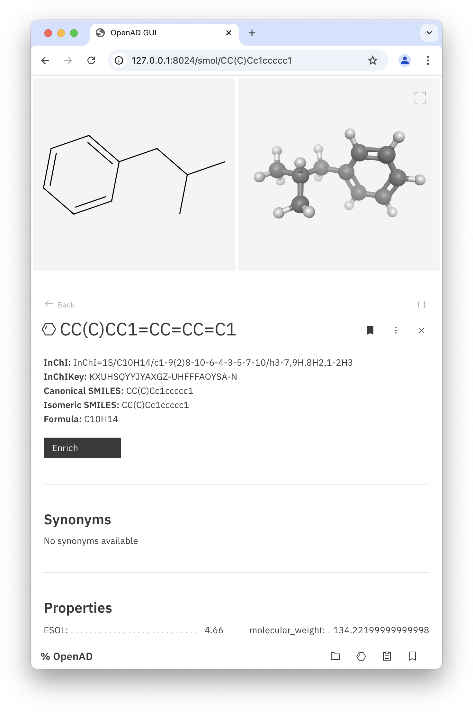
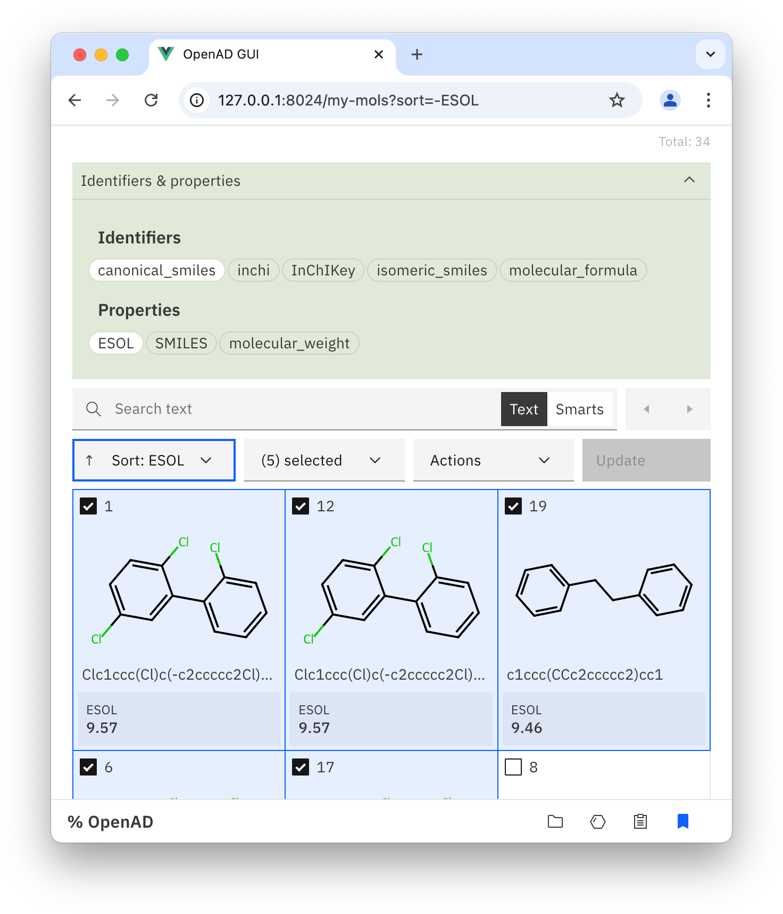

# Visualizing and Triaging Molecules

In this tutorial you’ll learn how to use OpenAD from the Terminal or a Jupyter Notebook to:

- Collate molecules from a number of SDF, CSV and SMI files
- _Calculate the ESOL property for your molecules ( see note below &nbsp; :carbon-icn-megaphone: )_
- Visually inspect and triage the results
- Export the top candidates into a new file

!!! note

    This tutorial will focus exclusively on managing and inspecting your molecules. If you want to learn how to use the OpenAD model service to calculate the ESOL property for your molecules, we will post a separate tutorial for that in the future.

## Install OpenAD

Find detailed installation instructions [here](https://github.com/acceleratedscience/openad-toolkit/blob/main/README/installation.md).

```shell
# Create virtual environment
python -m venv ~/ad-venv
source ~/ad-venv/bin/activate

# Install OpenAD
pip install openad
```

## Launch OpenAD in the Terminal

```shell
openad
```

<!--  -->

{ class=browser-ss style='width: 682px' }

## Using Jupyter Notebook

If you plan to use Jupyter notebook, you’ll first have to port our virtual environment to Jupyter.

```shell
python -m ipykernel install --user --name=ad-venv
```

{ class=browser-ss style='width: 736px' }

After selecting the ‘ad-venv’ virtual environment in the Jupyter UI, you can now access OpenAD with the use of “magic commands”.

This means you can run any OpenAD command by prepending it with `%openad`.

```shell
# Command in the CLI
list files

# Command in Jupyter Notebook
%openad list files
```

## Using your Molecule Working Set

Your molecule working set (MWS) is an in-memory list of small molecules that is the subject of your calculations and manipulations.

### Loading Individual Molecules

Let’s start with opening your (empty) MWS.

```shell
show molecules
```

Now we’ll add a few individual molecules to your MWS using various identifiers. By default, they will be enriched with data from PubChem.

```shell
add mol CC(C)Cc1ccccc1 force
add mol InChI=1S/C7H16O/c1-5-7(4,8)6(2)3/h6,8H,5H2,1-4H3 force
add mol Heptachlor force
add mol '3,3-dimethyl-2-butanol' force
```

Next you can quickly list your molecules…

```shell
list molecules
```

{ class=browser-ss style='width: 682px' }

…or inspect them in the GUI.

```shell
show molecules
```

{ class=browser-ss style='width: 752px' }

### Loading Molecules in Batch

You can load many molecules at once, from different file formats.

Download the sample files below and then copy them into your workspace.Update the file path if needed.

- [sample_molecules1.sdf](/_blog-assets/2025-03-10-gui/sample_molecules/sample_molecules1.sdf)
- [sample_molecules2.csv](/_blog-assets/2025-03-10-gui/sample_molecules/sample_molecules2.csv)
- [sample_molecules3.smi](/_blog-assets/2025-03-10-gui/sample_molecules/sample_molecules3.smi)

```shell
import from '~/Downloads/sample_molecules1.sdf' to 'sample_molecules1.sdf'
import from '~/Downloads/sample_molecules2.csv' to 'sample_molecules2.csv'
import from '~/Downloads/sample_molecules3.smi' to 'sample_molecules3.smi'
```

Once the files are in your workspace, you can easily load them into your MWS.

```shell
load mols from file 'sample_molecules1.sdf'
load mols from file 'sample_molecules2.csv' append
load mols from file 'sample_molecules3.smi' append
```

Now when you inspect your MWS, you’ll see you have 34 molecules loaded.

```shell
show molecules
```

### Manipulating Your Molecules

This is the stage where you’d use OpenAD or any other external tool to calculate certain properties or perform any other kind of manipulation.

If you’re using a Jupyter Notebook, we can load some example data into your MWS using a dataframe. Let’s assume we have calculated the estimated solubility of our molecules and we have stored the result into a CSV file.

Download the sample file below. Please note that this is random data, not actual ESOL values.

[sample_molecules_esol.csv](/_blog-assets/2025-03-10-gui/sample_molecules/sample_molecules_esol.csv)

Now let’s turn this CSV into a dataframe. Paste the code below into a Jupyter Notebook cell and update the file path if necessary.

```python
import pandas as pd
file_path = os.path.join('~/Downloads', 'sample_molecules_esol.csv')
esol_df = pd.read_csv(file_path)
esol_df
```

We can now add the data from this dataframe to your list of molecules.

Please note that your dataframe should have lowercase columns "smiles", "property" and "result" for this command to work.

```python
%openad merge mols data from dataframe esol_df
```

If you now inspect any individual molecules that’s present in your MWS, you’ll see it will have the ESOL property listed.

```python
%openad show mol CC(C)Cc1ccccc1
```

{ class=browser-ss style='width: 736px' }

### Performing Basic Triage

Now we have the ESOL value for each molecule, we can use the GUI to sort our list by ESOL value and trim it down to the 5 best performing molecules.

```shell
open molecules
```

1. First turn on the ESOL property in the “Identifiers & Properties” box on top.
1. Sort your molecules by their ESOL value.
1. Select the top-five molecules by clicking on the first one and shift-clicking on the last one.
1. Choose **Actions** > **keep selected** to delete all other molecules.
1. Choose **Actions** > **save as** and choose the format you want to save them as.

{ class=browser-ss style='width: 736px' }

For further processing within OpenAD, we recommend storing your molecules into our own `molset.json` format. For export to other applications, you can choose between CSV, SDF or SMI.

