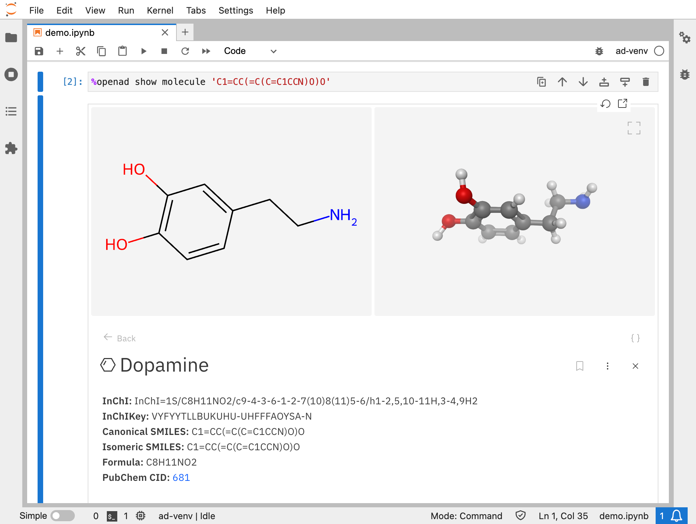
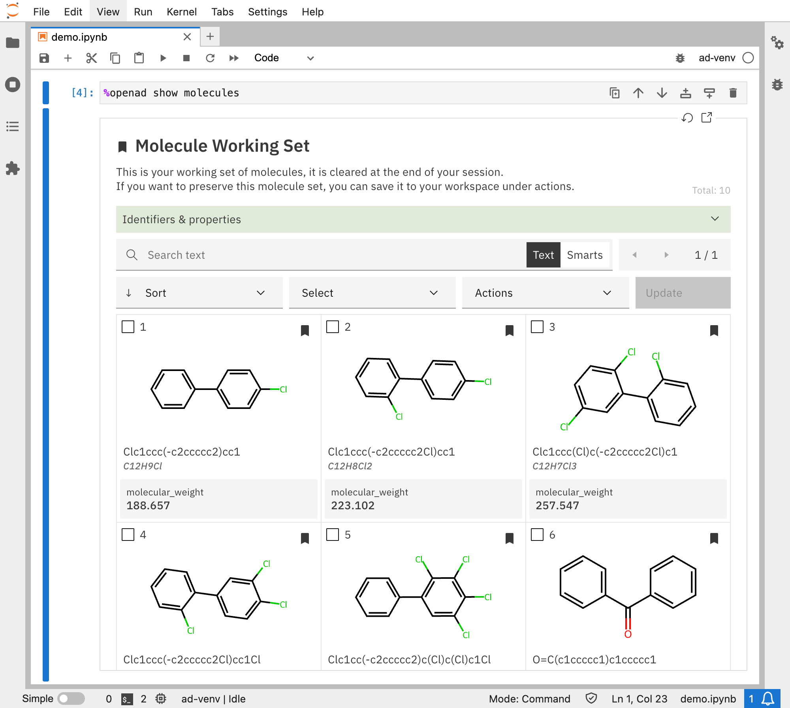
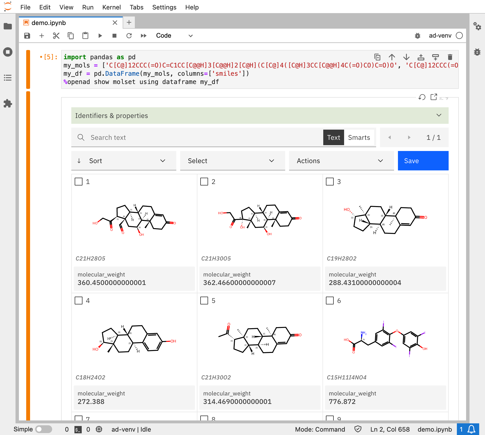
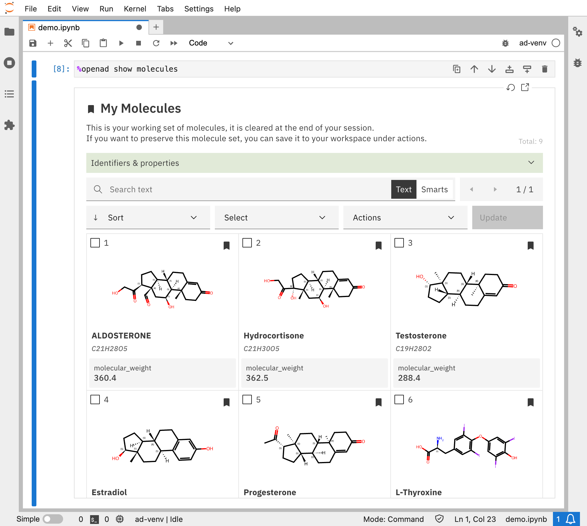
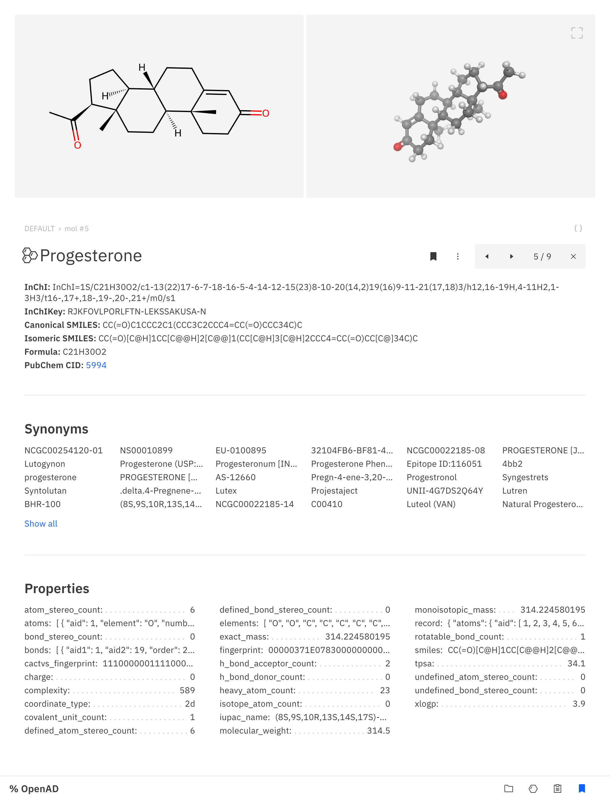

# How to Display Small Molecules in Jupyter Notebook

Learn how to use OpenAD to visualize molecules in 2D and 3D from different sources:

- SDF, CSV or SMI files
- A list of identifier like SMILES or InChI

<!-- more -->

## Install OpenAD

If you haven't already, [install OpenAD](/documentation/installation/#installing-openad) and activate the [OpenAD magic commands](/documentation/getting-started/#getting-started-jupyter).

👍 Congrats, that was the hard part.

## Visualizing a Single Molecule

```shell
%openad show molecule 'C1=CC(=C(C=C1CCN)O)O'
```

{ .img-border }


That was easy. And you can use any type of molecular identifier:  

- SMILES  
- InChI  

.. and if the molecule exists on PubChem:

- InChIKey
- name
- PubChem CID

```shell
%openad show molecule InChI=1S/C8H8/c1-2-5-3(1)7-4(1)6(2)8(5)7/h1-8H
```
```shell
%openad show molecule WAYJCOBMBRPWED-KWCYVHTRSA-N
```
```shell
%openad show molecule rubber
```
```shell
%openad show molecule 2854
```

## Visualizing Many Molecules at Once

Practically speaking, you will probably want to visualize many molecules at once, which is almost as easy. You can visualize molecules from:

- SDF files
- CSV files
- SMI files
- A dataframe
- A list of identifiers

### Visualizing molecules from SDF, CSV and SMI files.

For the purpose of this demo, download the sample files below:

-   [sample_molecules1.sdf](/_assets/sample_molecules/sample_molecules1.sdf)
-   [sample_molecules2.csv](/_assets/sample_molecules/sample_molecules2.csv)
-   [sample_molecules3.smi](/_assets/sample_molecules/sample_molecules3.smi)

Then in Jupyter, copy the files over to your workspace. Update the source paths if needed.

```shell
%openad import from '~/Downloads/sample_molecules1.sdf' to 'sample_molecules1.sdf'
%openad import from '~/Downloads/sample_molecules2.csv' to 'sample_molecules2.csv'
%openad import from '~/Downloads/sample_molecules3.smi' to 'sample_molecules3.smi'
```

You should get a success message if they're copied over successfully. You can check by listing the files in your workspace:

```shell
%openad list files
```

Next, we'll load the molecules from all three files into your molecule working set.

!!! info
    
    Your molecule working set (or MWS) is an in-memory list of small molecules that is the subject of your calculations and manipulations. To learn more, run `mws ?`

```shell
%openad load molecules from file 'sample_molecules1.sdf'
%openad load molecules from file 'sample_molecules2.csv'
%openad load molecules from file 'sample_molecules3.smi'
```

Once they're imported, you can visualize your molecule working set:

```shell
%openad show molecules
```

{ .img-border }

### Visualizing Molecules from a List or Pandas DataFrame

If you have your molecules stored anywhere else, you may want to visualize them using a DataFrame instead.

For this demo, we'll start with a list of SMILES (could be InChI too) of common hormones and convert them into a Pandas DataFrame with a "smiles" column.

```shell
import pandas as pd
my_mols = [
    'C[C@]12CCC(=O)C=C1CC[C@@H]3[C@@H]2[C@H](C[C@]4([C@H]3CC[C@@H]4C(=O)CO)C=O)O',
    'C[C@]12CCC(=O)C=C1CC[C@@H]3[C@@H]2[C@H](C[C@]4([C@H]3CC[C@@]4(C(=O)CO)O)C)O',
    'C[C@]12CC[C@H]3[C@H]([C@@H]1CC[C@@H]2O)CCC4=CC(=O)CC[C@]34C',
    'C[C@]12CC[C@H]3[C@H]([C@@H]1CC[C@@H]2O)CCC4=C3C=CC(=C4)O',
    'CC(=O)[C@H]1CC[C@@H]2[C@@]1(CC[C@H]3[C@H]2CCC4=CC(=O)CC[C@]34C)C',
    'C1=C(C=C(C(=C1I)OC2=CC(=C(C(=C2)I)O)I)I)C[C@@H](C(=O)O)N',
    'CC(=O)NCCC1=CNC2=C1C=C(C=C2)OC',
    'CNC[C@@H](C1=CC(=C(C=C1)O)O)O',
    'CC[C@H](C)[C@H]1C(=O)N[C@H](C(=O)N[C@H](C(=O)N[C@@H](CSSC[C@@H](C(=O)N[C@H](C(=O)N1)CC2=CC=C(C=C2)O)N)C(=O)N3CCC[C@H]3C(=O)N[C@@H](CC(C)C)C(=O)NCC(=O)N)CC(=O)N)CCC(=O)N'   
]
my_df = pd.DataFrame(my_mols, columns=['smiles'])
```

Next, we can visualize the DataFrame:

```shell
%openad show molset using dataframe my_df
```

{ .img-border }

As you can see, we don't get much more information than the SMILES and a vizualization. You could open the detail page of any of these molecules and click the "Enrich" button to fetch data from PubChem, or a more easy way is to load the molecules into your working set, and enrich them all at once.

```shell
%openad load molecules from dataframe my_df enrich
```

This will take a minute to loop through the molecules, but when you then visualize your working set next, you'll see that you now have an enriched list with all the molecule's names, as well as a bunch of properties that are available on PubChem.

```shell
%openad show molecules
```

{ .img-border }

{ .img-border }