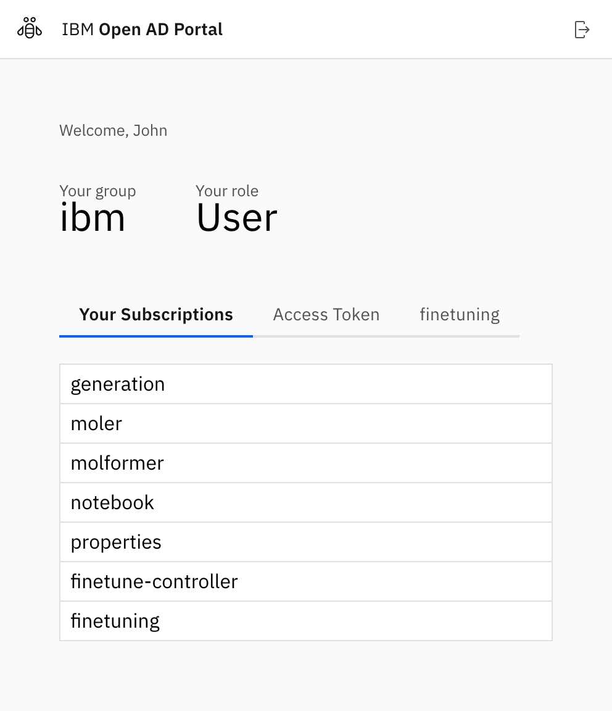

# Connecting to IBM-hosted Models

This service is for registered IBM partners only.  
Before you continue, make sure you know who your group admin is.

!!! note

    For more information about becoming an IBM partner, [get in touch](../../about.md).

## Step 1: Register at the OpenAD Portal

<div class="padded-list-next"></div>
1.  **Log in to the OpenAD Portal**  
    Go to [open.accelerate.science](https://open.accelerate.science) and log in with your IBMid, create one if necessary.  
    You'll see: _"Your account is pending to be added to a group"_

    { width=623px style='border: solid 1px var(--carbon-soft-hard)' }

2.  **Request Group Assignment**  
    Log out and contact your group administrator.  
    They will add you to the appropriate group.

3.  **Verify Account Setup**  
    Log in again after receiving confirmation.  
    Your _group_ and _role_ should be displayed.

## Step 2: Generate Access Token

<div class="tight-list-next"></div>
1. Navigate to the **Access Token** tab
2. Click **Generate Token**
3. Click anywhere on the token to copy it, you'll need it later

    !!! warning
        
        Treat your token like a password. It grants full access to the system under your credentials.

## Step 3: Connect to a Model

If you haven't already, [install OpenAD](../installation.md).

### 3.1. Choose a model

To see what model subscriptions you have access to, check the **Your Subscriptions** tab in the OpenAD Portal.

{ width=496px style='border: solid 1px var(--carbon-soft-hard)' }

### 3.2. Configure Authentication

Replace `YOUR_ACCESS_TOKEN` with your actual access token that you copied earlier.

```shell
model auth add group default with 'YOUR_ACCESS_TOKEN'
```

### 3.3. Connect to a Model

In this example we'll connect to the molformer model.

```shell
catalog model service from remote 'https://open.accelerate.science/proxy' as molformer using (auth_group=default inference-service=molformer)
```

#### Understanding the Connection Command

<div class='table-full-width-next'></div>
| Command Component                         | Description                          |
| ----------------------------------------- | ------------------------------------ |
| `catalog model service from remote`       | Connects to a model via URL          |
| `'https://open.accelerate.science/proxy'` | The endpoint for model inference     |
| `'molformer'`                             | Your chosen name for this service    |
| `USING (auth_group=default ...)`          | References your authentication group |
| `USING (... inference-service=molformer)` | The model subscription name          |

## Step 4: Verify the Connection

```shell
model service status
```

Expected output:

```text
Service    Status     Endpoint                               Host    Token Expires
---------  ---------  -------------------------------------  ------  -----------------
molformer  Connected  https://open.accelerate.science/proxy  remote  Wed Sep 11, 2030
```

## Step 5: Explore Available Model Functions

```shell
molformer ?
```

You'll see available commands for the model:

```text
Commands starting with "molformer"
- molformer get molecule property molformer_classification for [<list of SMILES>] | <SMILES> USING (<parameter>=<value> <parameter>=<value>) (save_as '<filename.csv>')
- molformer get molecule property molformer_multitask_classification for [<list of SMILES>] | <SMILES> USING (<parameter>=<value> <parameter>=<value>) (save_as '<filename.csv>')
- molformer get molecule property molformer_regression for [<list of SMILES>] | <SMILES> USING (<parameter>=<value> <parameter>=<value>) (save_as '<filename.csv>')
```

## Step 6: Run Model Inference

```shell
molformer get molecule property molformer_classification for 'OC12COC3=NCC1C23'
```

Expected output:

```text
subject           property                  result
----------------  ------------------------  --------
OC12COC3=NCC1C23  molformer_classification  [1]
```

---


## Command Documentation

See all command related to the model service:

```shell
model ?
```

To see detailed documentation for any individual command, append a `?` to the unique beginning of the command:

```shell
model auth add group ?
```

## Best Practices

-   Store important results using the `save_as` parameter.  
    Alternatively, you use a follow-up command: `result save`
-   Use descriptive service names when connecting to models.
-   Organize multiple models and authentication groups logically.
-   Back up your access token securely.

## Troubleshooting

-   **Connection Issues**: Verify your token has not expired and the inference URL is correct.
-   **Authentication Errors**: Regenerate your token if necessary.
-   **Model Not Available**: Check your dashboard for available model subscriptions.
-   **Model misspelled**: Make sure there is no typo in the `inference-service` parameter.
-   **Command Syntax Errors**: Use the `?` command to verify proper syntax.